# Level 5 Architecture — Graph-Native Context Engineering & Reasoning Platform

## Overview

This Level 5 architecture represents a reusable, asset-class-agnostic platform for:

- graph-native reasoning
- context engineering
- multimodal ingestion
- semantic retrieval
- agentic orchestration
- decision intelligence
- explainability and lineage
- recursive strategy evolution

The Natural Gas + Macroeconomics + Gamma Trading solution becomes the first domain pack built on top of the generic platform.

---

# Level 5 Architecture Diagram

```mermaid
flowchart TB

%% =========================================================
%% USERS / APPLICATIONS
%% =========================================================

subgraph UI["Application Layer"]
    Web["Next.js / React Web App"]
    Mobile["React Native / Flutter Mobile App"]
    Analyst["Analyst Workbench"]
    Obsidian["Obsidian Vault / Markdown Notes"]
    Admin["Admin Console"]
    APIClient["External API / SDK Clients"]
end

subgraph UX["User-Facing Capabilities"]
    NLQ["Natural Language Q&A"]
    GraphExplorer["Ontology / Context Graph Explorer"]
    SignalDash["Signals & Trade Strategy Dashboard"]
    NarrativeUI["Narrative Intelligence Explorer"]
    DecisionUI["Decision Lineage / Explainability UI"]
    SourceMgmt["Data Source Management UI"]
end

Web --> NLQ
Web --> GraphExplorer
Web --> SignalDash
Web --> NarrativeUI
Web --> DecisionUI
Web --> SourceMgmt
Mobile --> NLQ
Analyst --> NLQ
Analyst --> SignalDash
Obsidian --> SourceMgmt
Admin --> SourceMgmt
APIClient --> NLQ


%% =========================================================
%% API / ACCESS CONTROL
%% =========================================================

subgraph API["API, Security, and Serving Layer"]
    Gateway["API Gateway / Nginx / BFF"]
    Auth["OIDC / JWT / RBAC"]
    RateLimit["Rate Limits / Quotas"]
    MCP["MCP Servers"]
    GraphMCP["Neo4j Graph MCP Server"]
    DataMCP["Lakehouse / Athena MCP Server"]
    AgentAPI["Agent Orchestration API"]
end

NLQ --> Gateway
GraphExplorer --> Gateway
SignalDash --> Gateway
NarrativeUI --> Gateway
DecisionUI --> Gateway
SourceMgmt --> Gateway

Gateway --> Auth
Gateway --> RateLimit
Gateway --> MCP
MCP --> GraphMCP
MCP --> DataMCP
MCP --> AgentAPI


%% =========================================================
%% AGENTIC ORCHESTRATION
%% =========================================================

subgraph Agents["Agentic Reasoning & Workflow Layer"]
    Embabel["Embabel GOAP Planner"]
    Temporal["Temporal Durable Workflows"]
    Supervisor["Supervisor / Router Agent"]
    DataAgent["Data Sourcing Agent"]
    OntologyAgent["Ontology Mapping Agent"]
    EntityAgent["Entity Resolution Agent"]
    NarrativeAgent["Narrative Intelligence Agent"]
    QuantAgent["Feature Engineering / Econometrics Agent"]
    SignalAgent["Signal Generation Agent"]
    TradeAgent["Best Trade Analysis Agent"]
    RiskAgent["Risk / Scenario Agent"]
    ExplainAgent["Explainability / Audit Agent"]
    HITL["Human-in-the-Loop Approval"]
    ModelRouter["LLM / Model Router"]
end

AgentAPI --> Supervisor
Supervisor --> Embabel
Embabel --> Temporal

Temporal --> DataAgent
Temporal --> OntologyAgent
Temporal --> EntityAgent
Temporal --> NarrativeAgent
Temporal --> QuantAgent
Temporal --> SignalAgent
Temporal --> TradeAgent
Temporal --> RiskAgent
Temporal --> ExplainAgent
Temporal --> HITL

Supervisor --> ModelRouter


%% =========================================================
%% MODEL LAYER
%% =========================================================

subgraph Models["Model & Inference Layer"]
    PremiumLLM["Premium LLMs\nGPT / Claude / Gemini"]
    LocalLLM["Local LLMs\nOllama / Gemma / Llama"]
    Embeddings["Embedding Models"]
    Reranker["Rerankers"]
    Vision["Vision Models\nCharts / Candlesticks / Screenshots"]
    ForecastModels["Forecasting Models\nARIMA / Prophet / ML / Deep TS"]
    EconModels["Econometric Models\nOLS / HC3 / Panel / VAR"]
end

ModelRouter --> PremiumLLM
ModelRouter --> LocalLLM
ModelRouter --> Embeddings
ModelRouter --> Reranker
ModelRouter --> Vision
QuantAgent --> ForecastModels
QuantAgent --> EconModels


%% =========================================================
%% INGESTION SOURCES
%% =========================================================

subgraph Sources["External & Internal Data Sources"]
    EIA["EIA\nWNGSR / NGM / STEO"]
    NOAA["NOAA\nHDD / CDD / Weather"]
    LNG["LNG Feedgas / Shipping / Terminals"]
    MarketData["Market Data\nFutures / Options / Spot / OHLC"]
    SEC["SEC Filings\n10-K / 20-F / 8-K"]
    FRED["FRED / Macro Data"]
    RegGov["Regulations.gov"]
    NewsRSS["News / RSS / Research Feeds"]
    YouTube["YouTube Transcripts"]
    Podcasts["Spotify / Podcast Transcripts"]
    BloombergNEF["BloombergNEF / LinkedIn / Public Feeds"]
    ObsidianFiles["Obsidian Markdown Files"]
    UserUploads["User Uploads / PDFs / Spreadsheets"]
end

subgraph Ingest["Data Ingestion & Pipeline Layer"]
    Airflow["Airflow / MWAA DAGs"]
    Kafka["Kafka / Confluent"]
    Flink["Flink / Real-Time Derived Context"]
    Spark["Spark Structured Streaming / Batch"]
    Connectors["Connector Framework"]
    Scrapers["Crawlers / Scrapers"]
    TranscriptSvc["Transcript / Audio-to-Text Pipeline"]
    DocParser["Document Parser / OCR / PDF Extraction"]
    DQ["Data Quality / Validation"]
    PII["PII Removal / Obfuscation"]
end

EIA --> Connectors
NOAA --> Connectors
LNG --> Connectors
MarketData --> Connectors
SEC --> Connectors
FRED --> Connectors
RegGov --> Connectors
NewsRSS --> Scrapers
YouTube --> TranscriptSvc
Podcasts --> TranscriptSvc
BloombergNEF --> Scrapers
ObsidianFiles --> DocParser
UserUploads --> DocParser

Connectors --> Airflow
Scrapers --> Airflow
TranscriptSvc --> Airflow
DocParser --> Airflow

Airflow --> DQ
DQ --> PII
PII --> Kafka
Kafka --> Flink
Kafka --> Spark


%% =========================================================
%% STORAGE
%% =========================================================

subgraph Storage["Storage, Lakehouse, and Serving Stores"]
    S3["S3 / MinIO Raw Zone"]
    Iceberg["Apache Iceberg Tables"]
    Glue["Glue Data Catalog / Polaris / Nessie"]
    Athena["Athena / Trino / DuckDB Query Layer"]
    FeatureStore["Feature Store"]
    VectorDB["Vector Database"]
    Neo4j["Neo4j Context Graph"]
    DecisionGraph["Decision Graph"]
    ObjectStore["Artifacts Store"]
    AuditStore["Audit / Lineage Store"]
end

Spark --> S3
Spark --> Iceberg
Flink --> Iceberg
Airflow --> S3

Iceberg --> Glue
Glue --> Athena

Iceberg --> FeatureStore
Iceberg --> VectorDB
Iceberg --> Neo4j


%% =========================================================
%% GRAPH / SEMANTIC LAYER
%% =========================================================

subgraph GraphLayer["Multilayered Context Graph & Semantic Layer"]
    ExplicitGraph["Explicit Knowledge Graph"]
    ImplicitGraph["Implicit Context Graph"]
    TacitGraph["Tacit Knowledge Graph"]
    LexicalGraph["Lexical / Semantic Graph"]
    OntologyEngine["Ontology Engine"]
    EntityResolver["Entity Resolution Service"]
    Provenance["Provenance / Evidence Paths"]
    TemporalGraph["Temporal / Bitemporal Graph"]
    GraphRAG["Hybrid GraphRAG"]
    GDS["Neo4j Graph Data Science"]
end

Neo4j --> ExplicitGraph
Neo4j --> ImplicitGraph
Neo4j --> TacitGraph
Neo4j --> LexicalGraph
Neo4j --> TemporalGraph
OntologyEngine --> ExplicitGraph
OntologyEngine --> LexicalGraph
EntityResolver --> ExplicitGraph
EntityResolver --> ImplicitGraph
GraphRAG --> VectorDB
GraphRAG --> Neo4j
GDS --> Neo4j


%% =========================================================
%% DOMAIN PACKS
%% =========================================================

subgraph DomainPacks["Reusable Domain Packs"]
    CoreOntology["Core Abstract Ontology"]
    NGPack["Natural Gas Domain Pack"]
    MacroPack["Macro Domain Pack"]
    GammaPack["Gamma Trading Domain Pack"]
    NarrativePack["Narrative Intelligence Pack"]
    FuturePacks["Future Domain Packs"]
end

CoreOntology --> OntologyEngine
NGPack --> OntologyEngine
MacroPack --> OntologyEngine
GammaPack --> OntologyEngine
NarrativePack --> OntologyEngine
FuturePacks --> OntologyEngine


%% =========================================================
%% ANALYTICS / DECISIONING
%% =========================================================

subgraph Analytics["Analytics, Signals, and Decision Intelligence"]
    FeatureEng["Feature Engineering"]
    RegimeDetect["Regime Detection"]
    SpreadAnalytics["Spread Analytics"]
    GammaAnalytics["Gamma / Greeks / Volatility Analytics"]
    ScenarioEngine["Scenario Analysis"]
    Backtesting["Backtesting / Replay"]
    SignalRegistry["Signal Registry"]
    TradeSelector["Best Trade Selector"]
    RiskEngine["Risk Engine"]
    Playbooks["Playbook Library"]
    SelfLearning["Recursive Strategy Evolution"]
end

FeatureStore --> FeatureEng
FeatureEng --> RegimeDetect
FeatureEng --> SpreadAnalytics
FeatureEng --> GammaAnalytics
RegimeDetect --> SignalRegistry
SpreadAnalytics --> SignalRegistry
GammaAnalytics --> SignalRegistry
ScenarioEngine --> RiskEngine
Backtesting --> SignalRegistry
SignalRegistry --> TradeSelector
RiskEngine --> TradeSelector
TradeSelector --> DecisionGraph
Playbooks --> Embabel
DecisionGraph --> SelfLearning
SelfLearning --> Playbooks


%% =========================================================
%% EXPLAINABILITY / AUDIT
%% =========================================================

subgraph Explainability["Explainability, Governance, and Auditability"]
    EvidenceBundle["Evidence Bundles"]
    GraphPaths["Graph Path Explanations"]
    ModelCards["Model / Prompt / Tool Trace"]
    DataLineage["Data Lineage"]
    DecisionReplay["Decision Replay"]
    ApprovalLog["Approval / Override / Exception Log"]
    Compliance["Compliance & Governance"]
end

ExplainAgent --> EvidenceBundle
ExplainAgent --> GraphPaths
ExplainAgent --> ModelCards
ExplainAgent --> DataLineage
ExplainAgent --> DecisionReplay
HITL --> ApprovalLog


%% =========================================================
%% CROSS-LAYER FLOWS
%% =========================================================

DataAgent --> Connectors
OntologyAgent --> OntologyEngine
EntityAgent --> EntityResolver
NarrativeAgent --> NarrativePack
QuantAgent --> FeatureEng
SignalAgent --> SignalRegistry
TradeAgent --> TradeSelector
RiskAgent --> RiskEngine

GraphRAG --> Supervisor
DecisionGraph --> ExplainAgent
Neo4j --> GDS
Athena --> FeatureEng
VectorDB --> GraphRAG

NLQ --> GraphRAG
GraphExplorer --> Neo4j
SignalDash --> SignalRegistry
DecisionUI --> AuditStore
SourceMgmt --> DataAgent
```

---

# Architectural Principles

## 1. Platform First, Domain Second

The platform itself should be reusable and asset-class-agnostic.

Natural gas, macroeconomics, and gamma trading become domain packs layered onto the generic reasoning platform.

---

## 2. Everything Becomes Graph-Native

All information should ultimately resolve into:

- entities
- events
- relationships
- observations
- signals
- narratives
- decisions
- risks
- provenance paths

inside a temporal semantic context graph.

---

## 3. Hybrid GraphRAG

The platform should combine:

- graph traversal
- semantic retrieval
- vector search
- ontology reasoning
- temporal reasoning
- event reasoning
- narrative reasoning

rather than relying on vector-only RAG.

---

## 4. Domain Packs

The reusable platform can support many verticals:

| Domain | Examples |
|---|---|
| Natural Gas | Storage, LNG, Weather, Basis |
| Macro | Rates, FX, CPI, Labor |
| Gamma Trading | Options, Greeks, Volatility |
| Power Markets | Grid, Load, Generation |
| Metals | Copper, Silver, Rare Earths |
| Supply Chain | Shipping, Ports, Rail |
| AI Infrastructure | Datacenter Power Demand |
| Geopolitics | Sanctions, Trade Routes |

---

# Strategic Positioning

This is no longer merely:

> “A natural gas trading platform.”

It becomes:

> “A graph-native context engineering and reasoning platform for complex adaptive systems.”

The natural gas + macro + gamma use case becomes the flagship vertical implementation.

